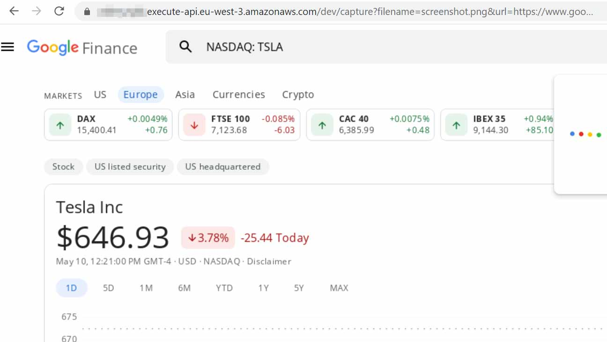

# PDFGenerator  

PDFGenerator allows you to easily generate PDF documents or PNG screenshots of any webpage using PHP.  

In the past we have used PhantomJS, wkhtmltopdf and TCPDF to generate PDF's from a given URL or HTML.
However, these libraries are no longer actively developed or maintained and lack support for newer features in HTML and CSS.
Google Chrome has a built in feature to take a screenshot of a webpage as PDF or PNG format with better support for new features.

Using [Amazon Lambda](https://aws.amazon.com/lambda/) and [Amazon API Gateway](https://aws.amazon.com/api-gateway/) you can minimize running costs, have scalable performance and flexible security controls.
Lambda is used to run a headless Chrome as an on-demand service to take screenshots from any website or submitted HTML content without having to set up a server.
You can configure security controls on the API Gateway like API keys, rate limiting, and quota to protect your screenshot service against third parties or inappropriate use.

[Puppeteer](https://pptr.dev/) is used to communicate with Chrome to load content and take screenshots programmatically.

## Requirements

To deploy Chrome on Amazon Lambda you will need:

1. An [Amazon AWS account](https://aws.amazon.com) to deploy the Lambda function
2. [Node.js](https://nodejs.org/en/download/) installed on your local machine
3. [Serverless](https://www.serverless.com/framework/docs/providers/aws/guide/installation/) installed on your local machine

To use this library in PHP:

1. [Composer](https://getcomposer.org/)
2. PHP 7+

<hr/>

## Deploying Chrome on Amazon Lambda

1. Go to the official [Node.js website](https://nodejs.org/en/download/), download and follow the [installation instructions](https://nodejs.org/en/download/) to install Node.js on your local machine.

2. Install the Serverless Framework via [npm](https://npmjs.org/) which was already installed when you installed Node.js.  
Open up a terminal and run the following command to install Serverless:  
```
npm install -g serverless
```

Next, you'll have to [set up your credentials](https://www.serverless.com/framework/docs/providers/aws/guide/credentials/) so that Serverless is able to connect to your Amazon AWS account to deploy the Lambda function and API Gateway.
The easiest way is to create a new IAM user and attach a custom JSON policy to limit the Serverless Framework's access to your AWS account. This way you don't have to sign up for an account on https://serverless.com either.  
To limit the Serverless Framework’s access your AWS account, follow these steps to **create an IAM User** and attach a custom JSON file policy to your new IAM User. This IAM User will have its own set of AWS Access Keys.

1. Login to your AWS Account and go to the Identity & Access Management (IAM) page.
2. Click on Users and then **Add user**. Enter a name in the first field to remind you this User is related to the Service you are deploying with the Serverless Framework, like `serverless-servicename-agent1`. Enable **Programmatic access** by clicking the checkbox. Click **Next** to go through to the Permissions page. Click on **Create policy**. Select the **JSON** tab, and add a JSON file. You can use [this gist](https://gist.github.com/ServerlessBot/7618156b8671840a539f405dea2704c8) as a guide.
3. When you are finished, select **Review policy**. You can assign this policy a **Name** and **Description**, then choose **Create Policy**. Check to make sure everything looks good and click **Create user**. Later, you can create different IAM Users for different apps and different stages of those apps. That is, if you don't use separate AWS accounts for stages/apps, which is most common.
4. View and copy the **API Key** & **Secret** and replace `<your-key-here>` and `<your-secret-key-here>` in the command below and run the command:  
```
serverless config credentials --provider aws --key <your-key-here> --secret <your-secret-key-here>
```

5. Navigate to the directory `screenshot-service` in this repository in your terminal window and install the required packages by running:
```
npm install
```

6. Open `screenshot-service/serverless.yml` and change the region on line 10 to the region you wish to deploy to on Amazon AWS as well as the corresponding reference to the required Lambda layer on line 27.
See [https://github.com/shelfio/chrome-aws-lambda-layer](https://github.com/shelfio/chrome-aws-lambda-layer) and [https://docs.aws.amazon.com/general/latest/gr/rande.html#regional-endpoints]{https://docs.aws.amazon.com/general/latest/gr/rande.html#regional-endpoints} for more information about the available regions and corresponding references for the Lambda layer.  
```
  region: eu-west-3
  ...
    layers: # reference to the already existing layer with Chrome
      - arn:aws:lambda:eu-west-3:764866452798:layer:chrome-aws-lambda:20
```

7. Next, deploy the screenshot service to Amazon AWS:  
```
serverless deploy --stage production
```

8. In the output of the command about you can find the endpoints for the GET and POST request.  


If you haven't configured any API keys yet in the API Gateway for the screenshot service, you can simply copy the endpoint URL of the GET request, append `?filename=screenshot.png&url=[URL of your website]` to the endpoint URL and open it in your browser.  
For example: `https://##########.execute-api.eu-west-3.amazonaws.com/dev/capture?filename=screenshot.png&url=https://www.google.com/finance/quote/TSLA:NASDAQ?hl=en` returns a screenshot of the Tesla stock on Google Finance:



## Securing your screenshot service

To protect the screenshot service against unauthorized use or access you can set up API Keys for the API Gateway.
**If you do not set up API Keys for the screenshot service other people may be able to use your installation to create screenshots which will add to your bill. It is important that you secure your API Gateway.**

**Make sure to redeploy the API for the API Key requirement to take effect!**

See [https://docs.aws.amazon.com/apigateway/latest/developerguide/api-gateway-setup-api-key-with-console.html](https://docs.aws.amazon.com/apigateway/latest/developerguide/api-gateway-setup-api-key-with-console.html) on how to set up API Keys.

## Installation of this library

```
composer require viavario\pdfgenerator
```

## Usage

```php
<?php
include_once __DIR__.'/vendor/autoload.php';

use viavario\pdfgenerator\PDFGenerator;

// This is invoke URL of the API Gateway or the endpoint returned by the
// serverless deploy command without `capture` at the end
$endpoint = 'https://##########.execute-api.eu-west-3.amazonaws.com/dev/';
$apiKey = '<your-api-key>'; // Your API Key configured in the API Gateway
$filename = 'screenshot.pdf'; // Change to screenshot.png to get a PNG image

$generator = new PDFGenerator($endpoint, $apiKey);
$generator->setURL('https://google.com')
    ->setFilename($filename)
    ->setMargins('1.5cm')
    ->setFormat('A4')
    // The screenshot service automatically increases the height of the viewport
    // to take a full page screenshot
    ->setViewportSize(1920, 1080)
    ->setOrientation(PDFGenerator::ORIENTATION_PORTRAIT);

try {
    $tempfile = $generator->generate();
    // Change the Content-Type to image/png if you changed the extension of the
    // filename to .png
    header('Content-Type: application/pdf');
    echo $tempfile;
}
catch (\Exception $e) {
    echo $e->getMessage();
}
```


## Methods

| Name | Description |
|------|-------------|
|[__construct](#pdfgenerator__construct)|Class constructor.|
|[displayHeaderFooter](#pdfgeneratordisplayheaderfooter)|Display the footer and header template.|
|[generate](#pdfgeneratorgenerate)|Generate a screenshot.|
|[omitBackground](#pdfgeneratoromitbackground)|Hides default white background and allows capturing screenshots with transparency. Defaults to false.|
|[preferCSSPageSize](#pdfgeneratorprefercsspagesize)|Give any CSS @page size declared in the page priority over what is declared in width and height or format options. Defaults to false, which will scale the content to fit the paper size.|
|[printBackground](#pdfgeneratorprintbackground)|Set to true to print backgrounds.|
|[setContent](#pdfgeneratorsetcontent)|Sets the content.|
|[setFilename](#pdfgeneratorsetfilename)|Sets the filename.|
|[setFooterTemplate](#pdfgeneratorsetfootertemplate)|Sets the Footer template.|
|[setFormat](#pdfgeneratorsetformat)|Sets the format of the page.|
|[setHeaderTemplate](#pdfgeneratorsetheadertemplate)|Sets the Header template.|
|[setHttpAuthentication](#pdfgeneratorsethttpauthentication)|Sets the HTTPAuthentication username and password.|
|[setMargins](#pdfgeneratorsetmargins)|Sets the margins for the page.|
|[setOrientation](#pdfgeneratorsetorientation)|Set the page orientation.|
|[setURL](#pdfgeneratorseturl)|Set the URL.|
|[setViewportSize](#pdfgeneratorsetviewportsize)|Sets the viewport height and viewport width.|


### PDFGenerator::__construct  

**Description**

```php
public __construct (string $endpoint, string $apiKey)
```

Class constructor. 

 

**Parameters**

* `(string) $endpoint`
: The endpoint URL  
* `(string) $apiKey`
: The API key for the AWS Lambda function

**Return Values**

`void`


<hr />


### PDFGenerator::displayHeaderFooter  

**Description**

```php
public displayHeaderFooter (bool $displayHeaderFooter)
```

Display the footer and header template. 

 

**Parameters**

* `(bool) $displayHeaderFooter`
: set to true to display the header and footer in the PDF document  

**Return Values**

`PDFGenerator`


<hr />


### PDFGenerator::generate  

**Description**

```php
public generate (string $filename)
```

Generate a screenshot. 

 

**Parameters**

* `(string) $filename`
: The filename to write to (defaults to null which will cause the method to return binary data)  

**Return Values**

`mixed`

> If no filename is specified, then the generated file is returned as binary data.  
If a filename is specified, then true is returned when the file was written  
successfully, or false otherwise.


<hr />


### PDFGenerator::omitBackground  

**Description**

```php
public omitBackground (bool $omitBackground)
```

Hides default white background and allows capturing screenshots with transparency. Defaults to false. 

 

**Parameters**

* `(bool) $omitBackground`
: set to true to omit white backgrounds  

**Return Values**

`PDFGenerator`


<hr />


### PDFGenerator::preferCSSPageSize  

**Description**

```php
public preferCSSPageSize (bool $preferCSSPageSize)
```

Give any CSS @page size declared in the page priority over what is declared in width and height or format
options. Defaults to false, which will scale the content to fit the paper size. 

 

**Parameters**

* `(bool) $preferCSSPageSize`
: set to true to enqble CSS page size  

**Return Values**

`PDFGenerator`


<hr />


### PDFGenerator::printBackground  

**Description**

```php
public printBackground (bool $printBackground)
```

Set to true to print backgrounds. 

 

**Parameters**

* `(bool) $printBackground`
: Set to true to print backgrounds  

**Return Values**

`PDFGenerator`


<hr />


### PDFGenerator::setContent  

**Description**

```php
public setContent (string $content)
```

Sets the content. 

 

**Parameters**

* `(string) $content`
: the HTML content to take a screenshot of  

**Return Values**

`PDFGenerator`


<hr />


### PDFGenerator::setFilename  

**Description**

```php
public setFilename (string $filename)
```

Sets the filename. 

 

**Parameters**

* `(string) $filename`
: Set the filename for the output. Only extensions .pdf and .png are allowed.  

**Return Values**

`PDFGenerator`


<hr />


### PDFGenerator::setFooterTemplate  

**Description**

```php
public setFooterTemplate (string $html)
```

Sets the Footer template. 

Should be valid HTML markup with following classes used to inject printing values into them:  
- date          formatted print date  
- title         document title  
- url           document location  
- pageNumber    current page number  
- totalPages    total pages in the document 

**Parameters**

* `(string) $html`
: HTML Markup  

**Return Values**

`PDFGenerator`


<hr />


### PDFGenerator::setFormat  

**Description**

```php
public setFormat (void)
```

Sets the format of the page. 

The format options are:  
- Letter: 8.5in x 11in  
- Legal: 8.5in x 14in  
- Tabloid: 11in x 17in  
- Ledger: 17in x 11in  
- A0: 33.1in x 46.8in  
- A1: 23.4in x 33.1in  
- A2: 16.54in x 23.4in  
- A3: 11.7in x 16.54in  
- A4: 8.27in x 11.7in  
- A5: 5.83in x 8.27in  
- A6: 4.13in x 5.83in 

**Parameters**

`This function has no parameters.`

**Return Values**

`PDFGenerator`


<hr />


### PDFGenerator::setHeaderTemplate  

**Description**

```php
public setHeaderTemplate (string $html)
```

Sets the Header template. 

Should be valid HTML markup with following classes used to inject printing values into them:  
- date          formatted print date  
- title         document title  
- url           document location  
- pageNumber    current page number  
- totalPages    total pages in the document 

**Parameters**

* `(string) $html`
: HTML Markup  

**Return Values**

`PDFGenerator`


<hr />


### PDFGenerator::setHttpAuthentication  

**Description**

```php
public setHttpAuthentication (void)
```

Sets the HTTPAuthentication username and password. 

 

**Parameters**

`This function has no parameters.`

**Return Values**

`PDFGenerator`


<hr />


### PDFGenerator::setMargins  

**Description**

```php
public setMargins (string $margins, string $right, string $bottom, string $left)
```

Sets the margins for the page. 

 

**Parameters**

* `(string) $margins`
: Top margin, or all margins  
* `(string) $right`
: Right margin  
* `(string) $bottom`
: bottom margin  
* `(string) $left`
: Left margin  

**Return Values**

`PDFGenerator`

> return this instance


<hr />


### PDFGenerator::setOrientation  

**Description**

```php
public setOrientation (string $orientation)
```

Set the page orientation. 

 

**Parameters**

* `(string) $orientation`
: PDFGenerator::ORIENTATION_LANDSCAPE or PDFGenerator::ORIENTATION_PORTRAIT  

**Return Values**

`PDFGenerator`


<hr />


### PDFGenerator::setURL  

**Description**

```php
public setURL (string $url)
```

Set the URL. 

 

**Parameters**

* `(string) $url`
: the URL of the page to take a screenshot of  

**Return Values**

`PDFGenerator`


<hr />


### PDFGenerator::setViewportSize  

**Description**

```php
public setViewportSize (void)
```

Sets the viewport height and viewport width. 

 

**Parameters**

`This function has no parameters.`

**Return Values**

`PDFGenerator`


<hr />


